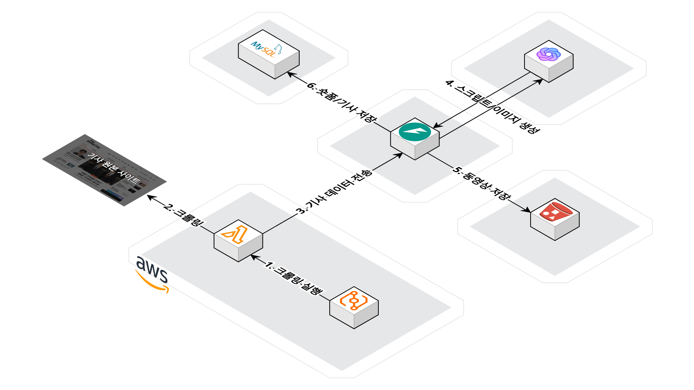
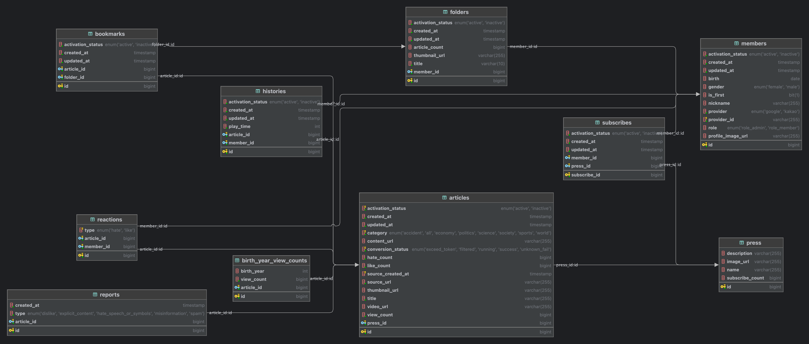

# 📰 뉴스를 한눈에, "뉴쓱"

<table>
  <tr>
    <td><strong>시작일</strong></td>
    <td>2024.08.19 (월)</td>
  </tr>
  <tr>
    <td><strong>종료일</strong></td>
    <td>2024.10.11 (금)</td>
  </tr>
</table>

 

## 1. 소개 📌

**뉴쓱**은 사람들이 뉴스를 더 쉽고 재밌게 소비할 수 있도록 **뉴스 기사를 숏폼 형태로 제공**하는 커뮤니티 플랫폼입니다.

사용자들은 간단한 숏폼 영상으로 최신 뉴스를 빠르게 확인하고, 접근성을 높인 인터페이스를 통해 다양한 뉴스를 소비할 수 있습니다.

 

## 2. 주요 기능 💻

### 2.1. 숏폼 영상 시청 🎬

숏폼으로 제작한 뉴스 기사를 오늘의 뉴스, 연령별 추천 기사, 전체 기사, 언론사별 기사, 카테고리 기반 추천을 통해 사용자에게 제공합니다.

-   일반 기사 조회
    -   오늘의 기사 : 오늘 발행된 최신 뉴스를 숏폼 영상으로 제공하여 사용자들이 최신 뉴스를 빠르게 확인할 수 있습니다.

    -   연령별 추천 기사 : 사용자의 연령대에 맞춰 가장 많이 조회된 뉴스를 추천해 주며, 연령대별로 적합한 콘텐츠를 제공합니다.

    -   전체 기사 : 전체 뉴스 기사를 카테고리 필터를 통해 원하는 분류의 기사를 쉽게 탐색할 수 있습니다.

-   카테고리 기반 추천 기사 : 사용자의 시청 기록을 바탕으로 가장 최근에 시정한 카테고리에 해당하는 기사를 제공합니다.

 

|    기사 조회        |              카테고리 기반 추천 기사               |
| :------------------------------------------: | :------------------------------------------------: |
|  |  |

---

### 2.2 언론사 구독 💼

사용자가 관심 있는 언론사를 구독하여 해당 언론사의 기사 숏폼을 모아볼 수 있습니다.

|                    언론사 구독                    |              구독한 언론사 기사 조회              |
| :-----------------------------------------------: | :-----------------------------------------------: |
|  |  |

---

### 2.3. 북마크 📂 

사용자가 보고 싶은 기사를 북마크할 수 있는 기능으로, '저장하기' 버튼을 눌러 자신이 만든 폴더에 숏폼 영상을 저장하여 언제든지 쉽게 다시 확인할 수 있습니다.

|                     북마크                     |                      북마크한 기사 조회                      |
| :--------------------------------------------: | :--------------------------------------------: |
|  |  |

---

### 2.4. 검색 🔍 

입력한 키워드를 포함한 언론사 또는 기사를 제공합니다.

<!-- |            검색            |
| :-----------------------------: |
|  | -->

  

 

## 3. 핵심 기능 🎥

뉴쓱의 핵심 기능인 **숏폼 생성**은 각 언론사에 보도된 뉴스 기사를 다음과 같은 과정을 통해 숏폼 영상으로 제작하여 사용자에게 제공합니다.

### 3.1. 숏폼 생성 과정 💡

---

### 3.2. 크롤링 🕷

BeautifulSoup4 라이브러리를 활용해 각 언론사별 크롤러를 구현했습니다.

---

### 3.3. 서버리스 환경 🌐 

크롤러는 AWS Lambda 를 통한 서버리스 환경에서 동작하고 있습니다.

이러한 설계는 다음과 같은 비교를 토대로 선택했습니다.

---

### 3.4. 프롬프트 엔지니어링 ⚙️

관련 논문을 참고해 정확도를 61%에서 87%로 상승시킨 5가지 방법 중 3가지를 적용하여 다음 사진과 같이 작성했습니다.

---

### 3.5. 시나리오 생성 📃

기사 원문을 전달하면 프롬프트를 통해 해당 기사를 6개의 장면으로 분할하여 다음과 같은 사진과 같이 각 장면에 대한 묘사와 대사를 생성합니다.

---

### 3.6. 이미지 생성 🎞️

프롬프팅 엔지니어링을 수행한 결과 다음 사진과 같으며, 생성한 시나리오의 **description**을 바탕으로 이미지를 생성합니다.

|                     수행전                    |                      수행후                      |
| :--------------------------------------------: | :--------------------------------------------: |
|  |  |

---

### 3.7. 나레이션 생성 🎙️

생성한 시나리오의 **dialogue**을 바탕으로 나레이션을 생성합니다.

---

### 3.8. 숏폼 생성 📹 

위에서 도출한 이미지 배열과 나레이션을 합쳐 숏폼 영상을 생성합니다.

 

## 4. 팀 구성 🧑🏻

### 🖥️ Client

| 김주연 | 김민경 | 오화랑 |
| :---: | :---: | :---: |
|  |  |  | | [izodam](https://github.com/izodam) | [mkkim68](https://github.com/mkkim68) [Hwarang-Oh](https://github.com/Hwarang-Oh) |

### 🖥️ Server

| 박근석 | 박상후 | 박찬규 |
| :---: | :---: | :---: |
|  |  |  | |[parkrootseok](https://github.com/parkrootseok) | [SangHuPark](https://github.com/SangHuPark) | [pcg0610](https://github.com/pcg0610) |

 

## 5. 사용 기술 ⚒️

### 🖥️ Client

|  |  |
| :----- | :----- |
| Framework            |  | 
| Language             |                                                                                                         |
| Styling              |                                                                                           |
| State Management     |   |
| Version Control      |                |
| IDE                  |                                                                                   |

### 🖥️ Server

|  |  |
| :------------------- | :-------------- |
| Framework             |   |
| Language |   |
| Database              |   |
|Monitoring |  |
| Cloud                 |   |
| DevOps                |   |  
| AI                    |   |
| Crawling              |    |
| Version Control       |   |
| IDE                   |  |
### 🖥️ Common

|  |  |
| :--- | :--- |
| Collaboration |     |

 

## 6. 산출물 📚
|  |  |
| :--: | ---: |
| Architecture |  |
| ERD          |  |
